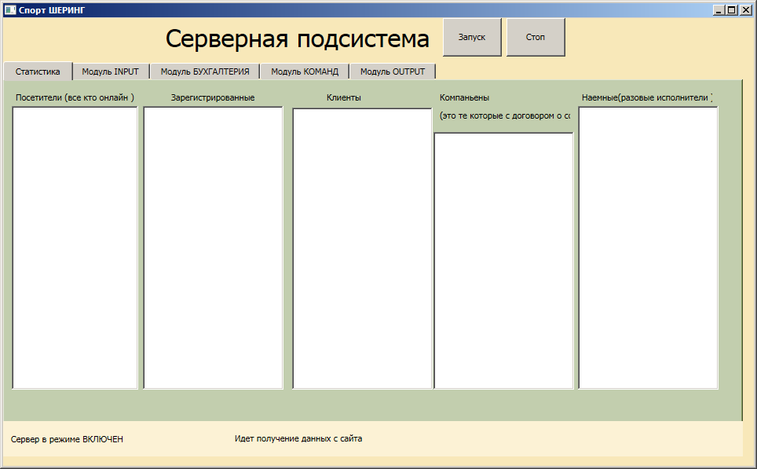
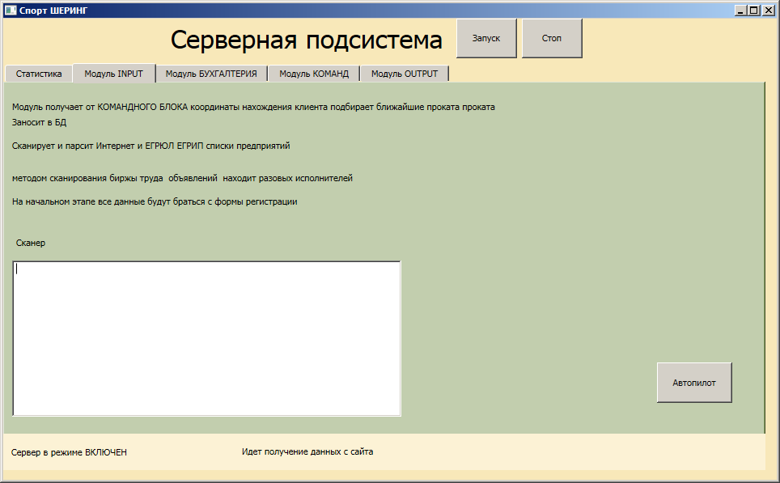

# hub-kms.github.io

                                                Краткое описание        

Клиентская часть - представляет из себя вебсайт, а также приложение для мобильных (покамесь для меня это черный ящик ) 
веб сайт это естественно HTML/CSS/JS/PHP,  при наличии в команде кодера на Python можно будет быстрей и качественней выполнить некоторый функционал 

Клиентская часть естественно как то надо взаимодействовать с серверной это делаем через СУБД и какуюто часть напрямую серверный модуль будет брать с Веб-сервера, например логи посещений, или сканирование и парсинг интернет ресурсов (С# это умеет) , СУБД для продакшн можно выбрать любую , мы же как в рамках ХАКАТОНА для исполнения прототипа так сказать чтобы запустить модель воспользуемся MySQL (в раамках ХАКАТОНА рпозволительно)

Серверная часть состоит из нескольких модулей  реализация на MS VS 2010 Expres C#

Серверной подсистемой ведеться мониторинг веб сервера в связке с которым и производиться разворачивание всей системы
Также Серверная подсистема ведет сканирование интернет ресурсов по поступающим командам с КОМАНДНОГО МОДУЛЯ
Собирает необходимую статистику
Произхводит заключение договоров с теми торговыми точками или частными лицами или наемными курьерами 
Каждый модуль автономен и вся сисема может в целом работать как портал для предостаавления проката как бы агрегатор пунктов проката а также физических лиц которые предоставляют хотят предоставить свои вещи в прокат

Скрин 1

Скрин 2

